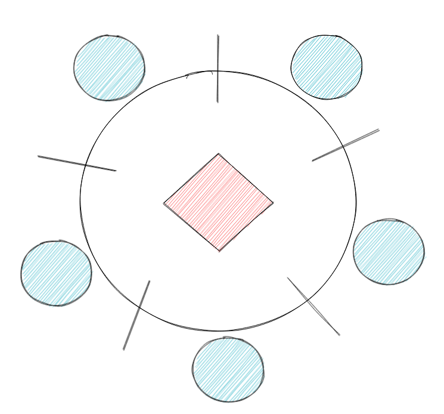

Herkese merhaba, filozoflar problemi bilgi işlem sistemlerinde **threadler** arasındaki senkronizasyon ve veri paylaşımının nasıl yapılacağını ele alan bir sorundur. Bu problem 5 filozofun bir yemek masasında oturdukları ve yemek yeme, uyuma, düşünme gibi temel konulara ihtiyaç duydukları bir senaryodan oluşur.



Buradaki asıl sorun şu ki her filozof sağında ve solunda birer çatal bulundurur ve yemek yemeye başlamadan önce sağındaki ve solundaki 2 çatalı da eline alması gereklidir. Fakat filozoflar aynı anda sağ ve solundaki çatalı almaya çalışırlarsa ortaya bir kavga etme durumu çıkabilir :) Teknik olarak açıklamak gerekirse aynı anda birden fazla thread tarafından aynı veri üzerinde işlem yapılmaya çalışılırsa sistem çökebilir.

Filozofların bu problemi, multi-threading sistemlerde veri paylaşımının nasıl yapılacağına bir çözüm bulmaya çalışır ve bunun aslında birçok yöntemi vardır. Bu yöntemlerden biri olan mutex ile sorunumuzu çözebiliyoruz.

Mutexlere gelmeden önce bilmemiz gereken bir diğer kavram ise data race'tir. Birden fazla thread aynı veriye erişme ve değiştirme çabasına girdiğinde data race oluşmuş olur. Bunu çözmek için mutex kullanıyoruz aslında.

Örnek bir data race kodu:

```c
#include <stdio.h>
#include <pthread.h>

int x = 0;

void *thread1_function(void *arg) {
int i;
for (i = 0; i < 100000; i++) {
x++;
}
return NULL;
}

void *thread2_function(void *arg) {
int i;
for (i = 0; i < 100000; i++) {
x--;
}
return NULL;
}

int main() {
pthread_t thread1, thread2;
pthread_create(&thread1, NULL, thread1_function, NULL);
pthread_create(&thread2, NULL, thread2_function, NULL);
pthread_join(thread1, NULL);
pthread_join(thread2, NULL);
printf("x'in son degeri: %d\n", x);
return 0;
}
```

Bu kodda, 2 farklı thread aynı x değişkeni üzerinde aynı anda işlem yapmaktadır. Bu durumda data race oluşur. Bunu çözmek içinse **mutex** kullanacağımızı söylemiştik.

Peki nedir bu mutex?
İsim olarak mutual exclusion kelimelerinin kısaltılıp birleşmesinden meydana gelir. Mutex, multi-threading ile çalışabilmemizi sağlar. Threadleri senkronize eder ve hepsinin aynı anda aynı veriye erişmesini engelleyerek önlem alır. Bunu da lock ve unlock ederek yapar.


```c
#include <pthread.h>
#include <stdio.h>
#include <stdlib.h>

int shared_variable = 0;
pthread_mutex_t mutex;

void *my_function(void *arg) {
  int i;
  for (i = 0; i < 1000000; i++) {
    pthread_mutex_lock(&mutex);
    shared_variable++;
    pthread_mutex_unlock(&mutex);
  }
  return NULL;
}

int main(void) {
  pthread_t thread1, thread2;

  pthread_mutex_init(&mutex, NULL);
  pthread_create(&thread1, NULL, my_function, NULL);
  pthread_create(&thread2, NULL, my_function, NULL);
  pthread_join(thread1, NULL);
  pthread_join(thread2, NULL);
  pthread_mutex_destroy(&mutex);

  printf("Shared variable value: %d\n", shared_variable);
  return 0;
}
```

Bu kodda, her çağrı için shared_variable değişkeni için mutex kilidini açıp kapatıyoruz. Bu sayede her çağrı için değerin güncellenmesi sırasında başka bir çağrının değeri değiştirmemesine engel oluyoruz. Bunun sonucunda değişken her zaman doğru sonuç veriri ve data race hatalarından korunur.


